# ArrivalLocationDetail システム設計書

## 1. システム概要

本システムは、Infor CloudSuite Industrial (CSI)の納入場所詳細管理機能を実現するものです。Mongoose FormScript（C#）とWebインターフェース（HTML/JavaScript）の連携により、納入場所の詳細情報表示、出荷指示の管理、ピッキング開始、出荷オーダー作成を行います。

---

## 2. システム関連図

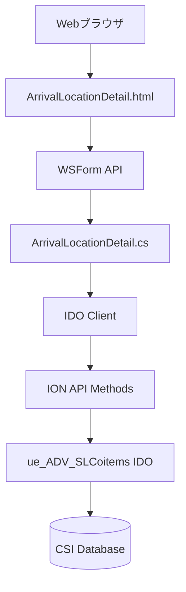

---

## 3. アーキテクチャ図

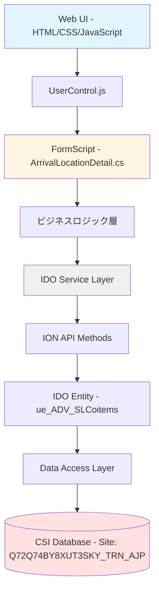

---

## 4. シーケンス図（機能フロー）

### 4.1 データ取得フロー

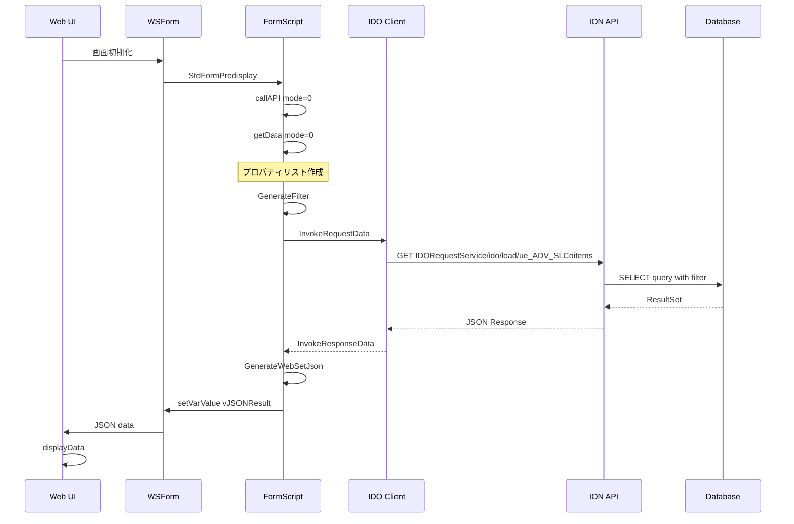

### 4.2 出荷オーダー更新フロー

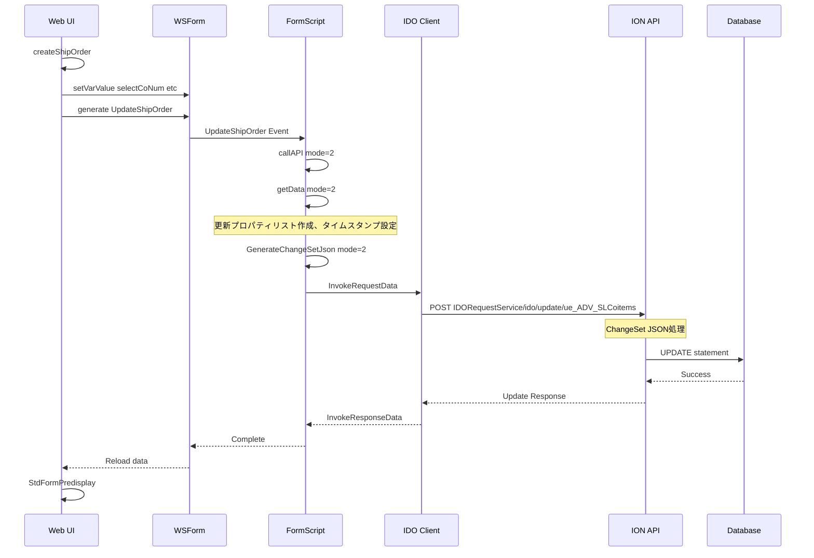

---

## 5. シーケンス図（ユーザー操作フロー）

### 5.1 画面初期表示

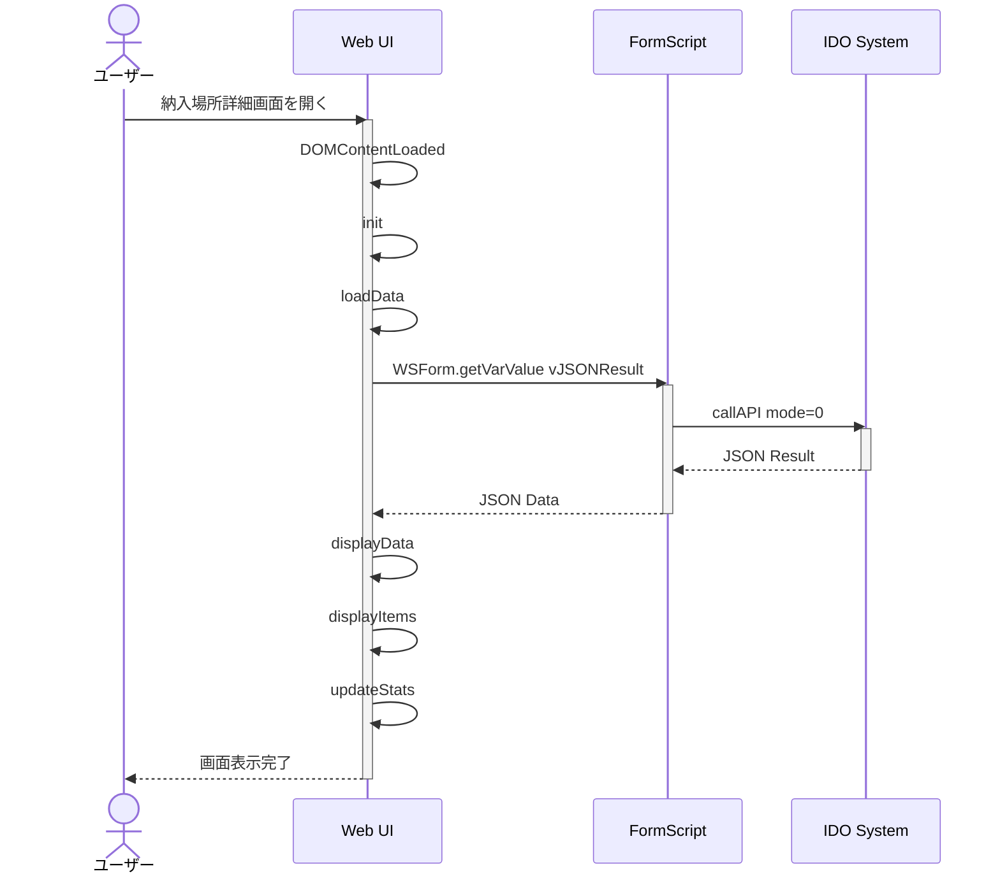

### 5.2 アイテム選択とピッキング開始

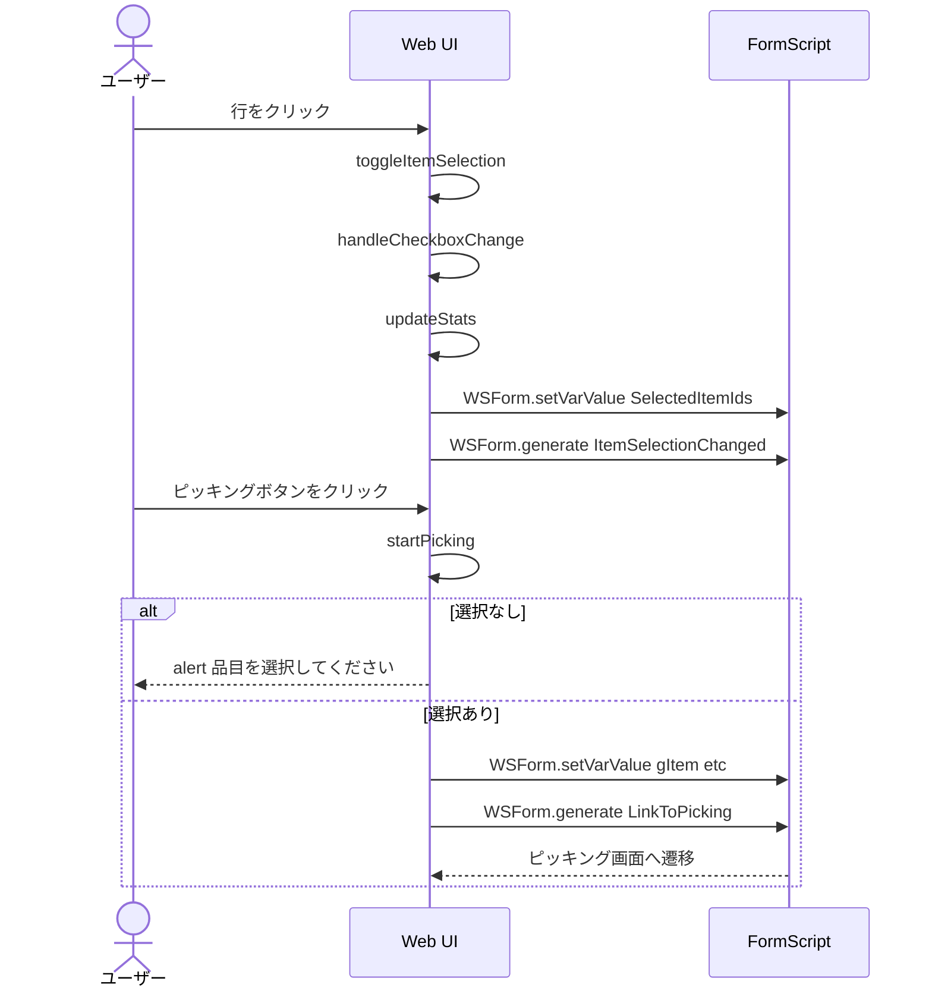

### 5.3 出荷オーダー作成

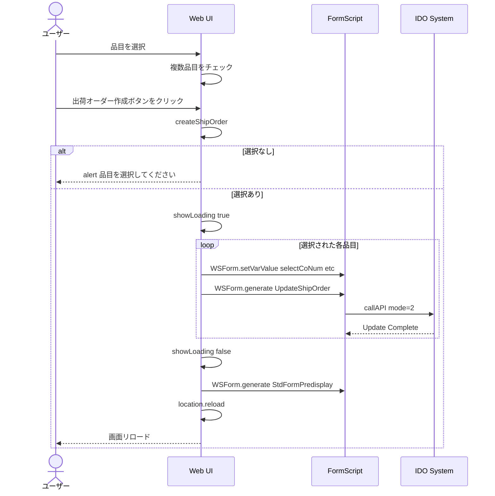

---

## 6. クラス図

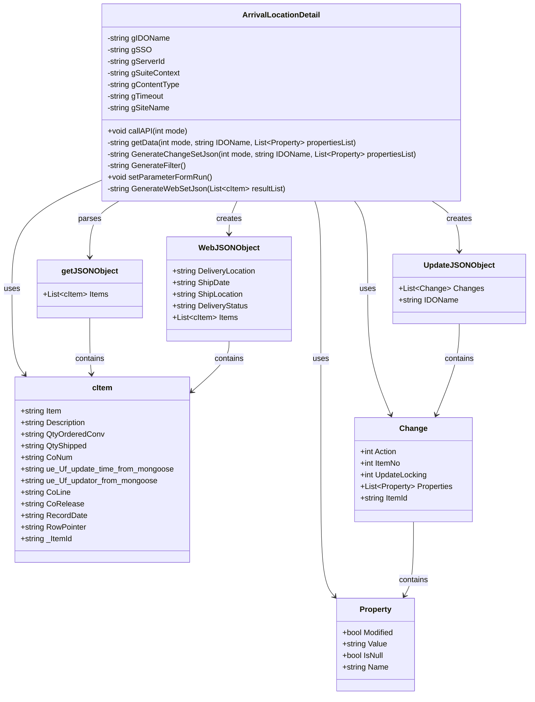

---

## 7. コンポーネント関連図

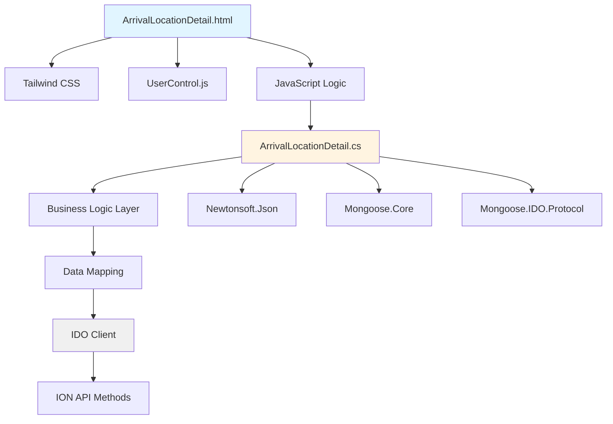

---

## 8. データフロー図

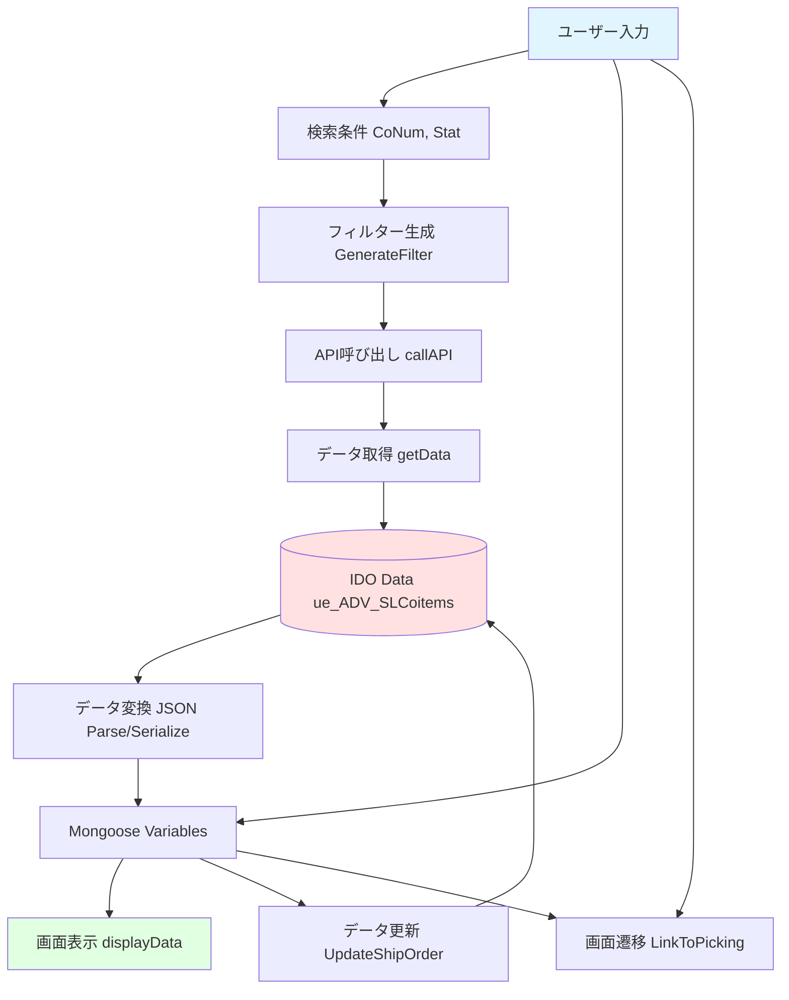

---

## 9. 配置図

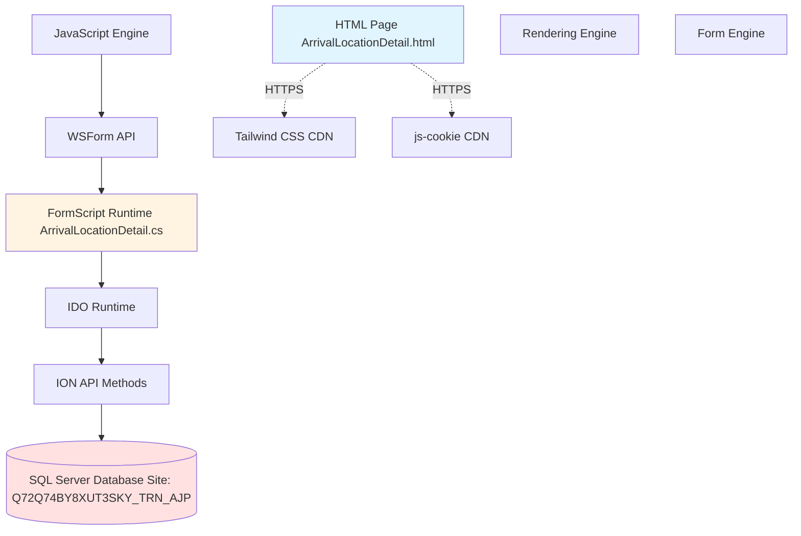

---

## 10. IDOと項目リスト

### 10.1 使用IDO情報

| 項目 | 値 |
|------|------|
| IDO名 | ue_ADV_SLCoitems |
| 説明 | 出荷指示品目管理IDO（カスタムIDO） |
| サイト | Q72Q74BY8XUT3SKY_TRN_AJP |
| ベーステーブル | (カスタム) |

### 10.2 IDOプロパティリスト

| プロパティ名 | データ型 | 説明 | 取得時 | 更新時 | キー |
|------------|---------|------|--------|--------|------|
| Item | String | 品目コード | ✓ | - | - |
| Description | String | 品目説明 | ✓ | - | - |
| QtyOrderedConv | Decimal | 注文数量 | ✓ | - | - |
| QtyShipped | Decimal | 出荷済数量 | ✓ | - | - |
| CoNum | String | オーダー番号 | ✓ | ✓ | ✓ |
| CoLine | Integer | オーダー明細行 | ✓ | ✓ | ✓ |
| CoRelease | Integer | リリース番号 | ✓ | ✓ | ✓ |
| ue_Uf_update_time_from_mongoose | DateTime | 更新日時 | ✓ | ✓ | - |
| ue_Uf_updator_from_mongoose | String | 更新者 | ✓ | ✓ | - |
| RecordDate | DateTime | レコード日付 | ✓ | ✓ | - |
| RowPointer | GUID | 行ポインタ | ✓ | ✓ | - |
| _ItemId | String | アイテムID | ✓ | ✓ | - |

### 10.3 フィルター条件

| パラメータ | 説明 | 使用箇所 |
|-----------|------|----------|
| CoNum | オーダー番号でフィルタ | GenerateFilter() |
| Stat | 納入状況でフィルタ (O:未済, P:計画, F:全数済, C:完了) | GenerateFilter() |

---

## 11. 画面項目のリスト

### 11.1 ヘッダー情報項目

| 項目ID | 表示ラベル | データソース | データ型 | 説明 |
|--------|-----------|-------------|---------|------|
| DeliveryLocation | 納入場所 | WebJSONObject.DeliveryLocation | String | 納入場所名称 |
| ShipDate | 出荷予定日 | WebJSONObject.ShipDate | Date | 出荷予定日（YYYYMMDD形式） |
| DeliveryStatus | 納入状況 | WebJSONObject.DeliveryStatus | String | O:未済, P:計画, F:全数済, C:完了 |
| ShipLocation | 出荷場所 | WebJSONObject.ShipLocation | String | 出荷元倉庫 |

### 11.2 品目一覧テーブル項目

| 列名 | 表示ラベル | データソース | データ型 | 説明 |
|------|-----------|-------------|---------|------|
| checkbox | 選択 | - | Checkbox | 品目選択用チェックボックス |
| Description | 品目名 | cItem.Description | String | 品目説明 |
| Item | 品目ID | cItem.Item | String | 品目コード |
| QtyOrderedConv | 品目数 | cItem.QtyOrderedConv | Decimal | 注文数量 |
| CoNum | オーダ番号 | cItem.CoNum | String | オーダー番号 |
| sShipOrderID | 送り状番号 | cItem.sShipOrderID | String | 出荷オーダーID |
| ue_Uf_updator_from_mongoose | 更新者 | cItem.ue_Uf_updator_from_mongoose | String | 最終更新者 |
| ue_Uf_update_time_from_mongoose | 更新時間 | cItem.ue_Uf_update_time_from_mongoose | DateTime | 最終更新日時 |

### 11.3 隠し項目（内部処理用）

| 項目名 | データソース | データ型 | 用途 |
|--------|-------------|---------|------|
| CoRelease | cItem.CoRelease | Integer | 更新時のキー項目 |
| RecordDate | cItem.RecordDate | DateTime | 更新時の識別項目 |
| RowPointer | cItem.RowPointer | GUID | 更新時の識別項目 |
| _ItemId | cItem._ItemId | String | 更新時の識別項目 |

### 11.4 統計情報項目

| 項目ID | 表示ラベル | 計算方法 | データ型 |
|--------|-----------|---------|---------|
| itemsCount | 品目数 | Items配列の長さ | Integer |
| selectedCount | 選択中 | 選択されたアイテム数 | Integer |
| totalQuantity | 合計数量 | 選択アイテムのQtyOrderedConv合計 | Decimal |

### 11.5 アクションボタン

| ボタンID | 表示テキスト | 関数 | 条件 |
|---------|-------------|------|------|
| pickingButton | ピッキング | startPicking() | 品目が1つ以上選択されていること |
| shipOrderButton | 出荷オーダー作成 | createShipOrder() | 品目が1つ以上選択されていること |
| backButton | 戻る | goBack() | 常に有効 |

---

## 12. 業務固有処理仕様書

### 12.1 業務固有クラス定義

#### 12.1.1 cItemクラス

**目的**: IDOから取得・更新するデータ項目を表現するデータクラス

```csharp
public class cItem
{
    // 取得予定のプロパティ
    [JsonProperty("Item")]
    public string Item { get; set; }                    // 品目コード

    [JsonProperty("Description")]
    public string Description { get; set; }             // 品目説明

    [JsonProperty("QtyOrderedConv")]
    public string QtyOrderedConv { get; set; }          // 注文数量

    [JsonProperty("QtyShipped")]
    public string QtyShipped { get; set; }              // 出荷済数量

    [JsonProperty("CoNum")]
    public string CoNum { get; set; }                   // オーダー番号

    // 更新情報
    [JsonProperty("ue_Uf_update_time_from_mongoose")]
    public string ue_Uf_update_time_from_mongoose { get; set; }  // 更新日時

    [JsonProperty("ue_Uf_updator_from_mongoose")]
    public string ue_Uf_updator_from_mongoose { get; set; }      // 更新者

    // キー項目
    [JsonProperty("CoLine")]
    public string CoLine { get; set; }                  // オーダー明細行

    [JsonProperty("CoRelease")]
    public string CoRelease { get; set; }               // リリース番号

    // 更新時必要のプロパティ（IDO作成時自動生成）
    [JsonProperty("RecordDate")]
    public string RecordDate { get; set; }              // レコード日付

    [JsonProperty("RowPointer")]
    public string RowPointer { get; set; }              // 行ポインタ

    [JsonProperty("_ItemId")]
    public string _ItemId { get; set; }                 // アイテムID
}
```

**使用箇所**:
- データ取得時のJSON→オブジェクト変換
- データ更新時のオブジェクト→JSON変換
- Web画面へのデータ送信

---

#### 12.1.2 WebJSONObjectクラス

**目的**: Web画面に送信するデータ構造を定義

```csharp
public class WebJSONObject
{
    [JsonProperty("DeliveryLocation")]
    public string DeliveryLocation { get; set; }        // 納入場所

    [JsonProperty("ShipDate")]
    public string ShipDate { get; set; }                // 出荷予定日

    [JsonProperty("ShipLocation")]
    public string ShipLocation { get; set; }            // 出荷場所（倉庫）

    [JsonProperty("DeliveryStatus")]
    public string DeliveryStatus { get; set; }          // 納入状況

    [JsonProperty("Items")]
    public List<cItem> Items { get; set; }              // 品目リスト
}
```

**使用箇所**:
- GenerateWebSetJson()メソッドでの生成
- vJSONResult変数への格納

---

### 12.2 業務固有メソッド定義

#### 12.2.1 callAPI()メソッド

**目的**: IDO APIを呼び出してデータ取得・更新を行う

**シグネチャ**:
```csharp
public void callAPI(int mode)
```

**パラメータ**:
| パラメータ名 | 型 | 説明 |
|------------|---|------|
| mode | int | 操作モード 0: 取得, 1: 挿入, 2: 更新, 4: 削除 |

**処理フロー**:

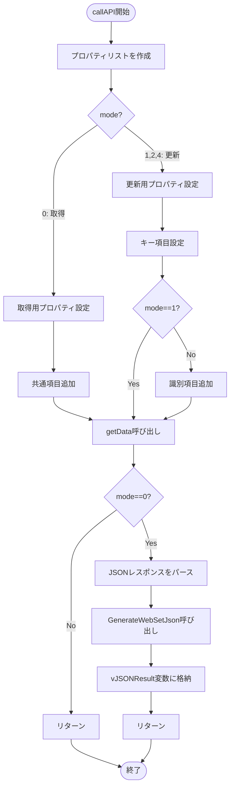

**取得時のプロパティリスト（mode=0）**:
```csharp
propertiesList.Add(new Property { Name = "Item", Value = "", Modified = true });
propertiesList.Add(new Property { Name = "Description", Value = "", Modified = true });
propertiesList.Add(new Property { Name = "QtyOrderedConv", Value = "", Modified = true });
propertiesList.Add(new Property { Name = "QtyShipped", Value = "", Modified = true });
propertiesList.Add(new Property { Name = "CoNum", Value = "", Modified = false });
propertiesList.Add(new Property { Name = "ue_Uf_update_time_from_mongoose", Value = "", Modified = true });
propertiesList.Add(new Property { Name = "ue_Uf_updator_from_mongoose", Value = "", Modified = true });
propertiesList.Add(new Property { Name = "RecordDate", Value = "", Modified = true });
propertiesList.Add(new Property { Name = "RowPointer", Value = "", Modified = true });
propertiesList.Add(new Property { Name = "_ItemId", Value = "", Modified = true });
propertiesList.Add(new Property { Name = "CoLine", Value = "", Modified = false });
propertiesList.Add(new Property { Name = "CoRelease", Value = "", Modified = false });
```

**更新時のプロパティリスト（mode=2）**:
```csharp
// 日本標準時でタイムスタンプ生成
TimeZoneInfo jstZone = TimeZoneInfo.FindSystemTimeZoneById("Tokyo Standard Time");
DateTime utcNow = DateTime.UtcNow;
DateTime jstNow = TimeZoneInfo.ConvertTimeFromUtc(utcNow, jstZone);

propertiesList.Add(new Property { 
    Name = "ue_Uf_update_time_from_mongoose", 
    Value = jstNow.ToString(), 
    Modified = true 
});
propertiesList.Add(new Property { 
    Name = "ue_Uf_updator_from_mongoose", 
    Value = ThisForm.Variables("User").Value, 
    Modified = true 
});
propertiesList.Add(new Property { 
    Name = "CoNum", 
    Value = ThisForm.Variables("selectCoNum").Value, 
    Modified = false 
});
propertiesList.Add(new Property { 
    Name = "CoLine", 
    Value = ThisForm.Variables("selectCoLine").Value, 
    Modified = false 
});
propertiesList.Add(new Property { 
    Name = "CoRelease", 
    Value = ThisForm.Variables("selectCoRelease").Value, 
    Modified = false 
});
propertiesList.Add(new Property { 
    Name = "RecordDate", 
    Value = ThisForm.Variables("selectRecordDate").Value, 
    Modified = true 
});
propertiesList.Add(new Property { 
    Name = "RowPointer", 
    Value = ThisForm.Variables("selectRowPointer").Value, 
    Modified = true 
});
propertiesList.Add(new Property { 
    Name = "_ItemId", 
    Value = ThisForm.Variables("selectItemId").Value, 
    Modified = true 
});
```

---

#### 12.2.2 GenerateFilter()メソッド

**目的**: IDO取得時のフィルター文字列を動的に生成

**シグネチャ**:
```csharp
private string GenerateFilter()
```

**戻り値**:
| 型 | 説明 |
|----|------|
| string | フィルター文字列（例: "&filter=CoNum='UE00000002' and Stat='O'"） フィルター条件がない場合は空文字列 |

**処理ロジック**:

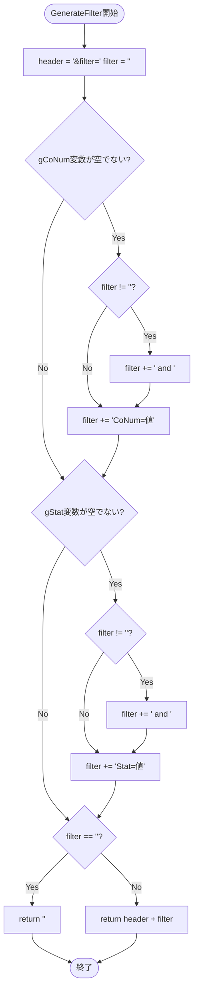

**使用する変数**:
| 変数名 | 説明 | 取得元 |
|--------|------|--------|
| gCoNum | オーダー番号 | ThisForm.Variables("gCoNum").Value |
| gStat | 納入状況 | ThisForm.Variables("gStat").Value |

**フィルター例**:
```
// オーダー番号のみ指定
&filter=CoNum='UE00000002'

// 納入状況のみ指定
&filter=Stat='O'

// 両方指定
&filter=CoNum='UE00000002' and Stat='O'

// 未指定
（空文字列）
```

---

#### 12.2.3 GenerateWebSetJson()メソッド

**目的**: Web画面用のJSON文字列を生成

**シグネチャ**:
```csharp
private string GenerateWebSetJson(List<cItem> resultList)
```

**パラメータ**:
| パラメータ名 | 型 | 説明 |
|------------|---|------|
| resultList | List&lt;cItem&gt; | IDOから取得した品目リスト |

**戻り値**:
| 型 | 説明 |
|----|------|
| string | 整形されたJSON文字列 |

**処理フロー**:

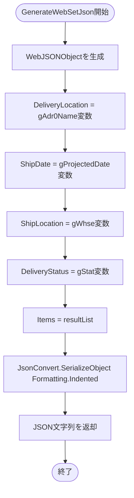

**使用する変数**:
| 変数名 | 説明 | 取得元 |
|--------|------|--------|
| gAdr0Name | 納入場所名 | ThisForm.Variables("gAdr0Name").Value |
| gProjectedDate | 出荷予定日 | ThisForm.Variables("gProjectedDate").Value |
| gWhse | 出荷場所（倉庫） | ThisForm.Variables("gWhse").Value |
| gStat | 納入状況 | ThisForm.Variables("gStat").Value |

**出力JSON例**:
```json
{
  "DeliveryLocation": "東京営業所",
  "ShipDate": "20250911",
  "ShipLocation": "NGT",
  "DeliveryStatus": "O",
  "Items": [
    {
      "Item": "205921800900400000-1174",
      "Description": "三井金属C2600R12H色材-H_0.64/50/0",
      "QtyOrderedConv": "2.000",
      "QtyShipped": "1.000",
      "CoNum": "UE00000002",
      "ue_Uf_update_time_from_mongoose": "2024/10/01 13:13:00",
      "ue_Uf_updator_from_mongoose": "ADMIN",
      "CoLine": "2",
      "CoRelease": "0",
      "RecordDate": "2024-07-16T00:00:00",
      "RowPointer": "a1b2c3d4-e5f6-7890-abcd-ef1234567890",
      "_ItemId": "UE00000002~2~0"
    }
  ]
}
```

---

#### 12.2.4 setParameterFormRun()メソッド

**目的**: 画面遷移時にパラメータを設定（現在はコメントアウト、将来拡張用）

**シグネチャ**:
```csharp
public void setParameterFormRun()
```

**処理内容**:
現在はコメントアウトされているが、将来的に他画面への遷移時にパラメータを設定する用途を想定。

**想定される実装**:
```csharp
public void setParameterFormRun()
{
    // グリッドの値を変数に持たせる（Web移行により不要）
    // ThisForm.Variables("gItem").Value = ...;
    // ThisForm.Variables("gDescription").Value = ...;
    // etc.
}
```

---

### 12.3 業務固有設定値

#### 12.3.1 グローバル定数

| 定数名 | 値 | 説明 | 変更可否 |
|--------|---|------|---------|
| gIDOName | "ue_ADV_SLCoitems" | ターゲットIDO名 | ✓ 業務要件 |
| gSSO | "1" | SSO使用フラグ | △ 環境設定 |
| gServerId | "0" | APIサーバID | △ 環境設定 |
| gSuiteContext | "CSI" | APIスイートコンテキスト | △ 環境設定 |
| gContentType | "application/json" | コンテンツタイプ | × 固定 |
| gTimeout | "10000" | タイムアウト(ms) | △ 性能要件 |
| gSiteName | "Q72Q74BY8XUT3SKY_TRN_AJP" | サイト名 | ✓ 環境依存 |

**注意事項**:
- ✓: 業務要件により変更が必要
- △: 環境や性能要件により変更の可能性あり
- ×: 変更不可

---

### 12.4 業務ルール

#### 12.4.1 データ取得ルール

1. **フィルター条件**:
   - オーダー番号（gCoNum）と納入状況（gStat）の両方またはいずれかでフィルタリング可能
   - 両方未指定の場合は全件取得

2. **取得項目**:
   - 表示用項目: Item, Description, QtyOrderedConv, QtyShipped, CoNum
   - 更新情報: ue_Uf_update_time_from_mongoose, ue_Uf_updator_from_mongoose
   - 内部管理項目: RecordDate, RowPointer, _ItemId, CoLine, CoRelease

#### 12.4.2 データ更新ルール

1. **タイムスタンプ**:
   - 日本標準時（JST）で更新日時を記録
   - フォーマット: DateTime.ToString()のデフォルト形式

2. **更新者**:
   - Mongoose変数「User」から取得
   - 更新時に必ず記録

3. **キー項目**:
   - CoNum + CoLine + CoRelease の組み合わせで一意に識別
   - 更新時は RecordDate, RowPointer, _ItemId も必要

#### 12.4.3 画面連携ルール

1. **Web画面へのデータ送信**:
   - vJSONResult変数にJSON文字列を格納
   - WebJSONObject形式で送信

2. **Web画面からのデータ受信**:
   - 選択された品目情報を個別変数で受け取り
   - selectCoNum, selectCoLine, selectCoRelease, selectRecordDate, selectRowPointer, selectItemId

---

### 12.5 エラーハンドリング

#### 12.5.1 API呼び出しエラー

```csharp
if (response.IsReturnValueStdError())
{
    string errorMsg = null;
    errorMsg = response.Parameters[8].Value;
    errorMsg += "\r\n" + response.Parameters[11].Value;
    throw new Exception(string.Format("Trigger of IONAPI Method Failed : {0}", errorMsg));
}
```

**エラー情報の取得箇所**:
- Parameters[8]: ResponseCode
- Parameters[11]: ResponseInfobar

#### 12.5.2 想定されるエラーケース

| エラーケース | 発生箇所 | 対処方法 |
|------------|---------|---------|
| IDOが存在しない | getData() | IDO名の確認、サイト名の確認 |
| プロパティが存在しない | getData() | プロパティリストの見直し |
| キー項目の不一致 | Update時 | キー項目の値を確認 |
| タイムアウト | API呼び出し | gTimeout値の調整 |
| 権限エラー | API呼び出し | ユーザー権限の確認 |

---

### 12.6 テストケース仕様

#### 12.6.1 取得処理テスト

| テストケース | 入力条件 | 期待結果 |
|------------|---------|---------|
| TC001 | gCoNum="UE00000002", gStat="" | CoNum='UE00000002'でフィルタされた全件取得 |
| TC002 | gCoNum="", gStat="O" | Stat='O'でフィルタされた全件取得 |
| TC003 | gCoNum="UE00000002", gStat="O" | 両条件でフィルタされたデータ取得 |
| TC004 | gCoNum="", gStat="" | 全件取得 |
| TC005 | 存在しないCoNum | 0件の結果が返却される |

#### 12.6.2 更新処理テスト

| テストケース | 入力条件 | 期待結果 |
|------------|---------|---------|
| TC101 | 有効なキー項目で更新 | 更新成功、タイムスタンプ・更新者が記録される |
| TC102 | 無効なキー項目で更新 | エラーが返却される |
| TC103 | 更新後のデータ再取得 | 更新内容が反映されている |

#### 12.6.4 Web連携テスト

| テストケース | 入力条件 | 期待結果 |
|------------|---------|---------|
| TC201 | IDOデータ取得後 | vJSONResult変数にWebJSONObject形式のJSON文字列が格納される |
| TC202 | Web画面から選択情報受信 | select*変数にデータが正しく設定される |
| TC203 | 複数品目の更新 | 全品目が正しく更新される |

---

## 13. 補足資料

### 13.1 命名規則

| 種類 | 規則 | 例 |
|------|------|---|
| グローバル変数 | gで始まる | gIDOName, gSSO |
| Mongoose変数 | 説明的な名前 | gCoNum, gStat, vJSONResult |
| クラス | PascalCase | cItem, WebJSONObject |
| メソッド | PascalCase | callAPI, getData |
| プライベートメソッド | PascalCase | GenerateFilter, GenerateWebSetJson |

### 13.2 変更履歴管理

業務要件変更時に修正が必要な箇所:

1. **IDO変更時**:
   - gIDOName定数
   - cItemクラスのプロパティ
   - callAPI()のプロパティリスト

2. **フィルター条件変更時**:
   - GenerateFilter()メソッド
   - 使用する変数の追加

3. **画面項目変更時**:
   - WebJSONObjectクラス
   - GenerateWebSetJson()メソッド

### 13.3 パフォーマンス考慮事項

1. **データ取得量**:
   - 適切なフィルター条件を設定して取得データ量を制限
   - ページングが必要な場合は別途実装

2. **タイムアウト設定**:
   - デフォルト10秒（gTimeout）
   - 大量データ取得時は調整が必要

3. **JSON変換**:
   - Newtonsoft.Jsonを使用した効率的な変換
   - 大量データの場合はストリーミング処理を検討

---
以上
