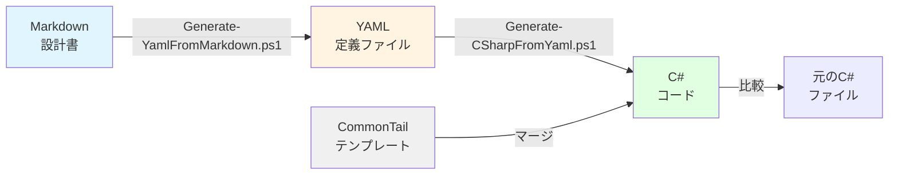

# ArrivalLocationDetail C# FormScript 生成システム

YAMLベースのコード生成システムで、Markdownの設計書からC# FormScriptを自動生成します。

## 📁 ファイル構成

```
ArrivalLocationDetail/
│
├── ArrivalLocationDetail.md              # 設計書（Markdown）
├── ArrivalLocationDetail.cs              # 元のC#コード
├── ArrivalLocationDetail.YAML            # YAML定義ファイル（生成される）
├── Generated_ArrivalLocationDetail.cs    # 生成されたC#コード
│
├── CommonTail.cs.template                # 共通処理テンプレート（178行目以降）
│
├── Master-Generate.ps1                   # 🔥 統合マスタースクリプト
├── Generate-YamlFromMarkdown.ps1         # Markdown→YAML変換
├── Generate-CSharpFromYaml.ps1           # YAML→C#変換
│
└── README.md                             # このファイル
```

## 🚀 クイックスタート

### 1. 全自動生成（推奨）

```powershell
# すべての処理を一括実行
.\Master-Generate.ps1 -Mode full
```

これで以下が自動的に実行されます:
- Markdown → YAML 変換
- YAML → C# 変換
- 元のファイルとの比較
- 構文検証

### 2. 個別実行

#### Markdown から YAML を生成

```powershell
.\Generate-YamlFromMarkdown.ps1 -MarkdownPath "ArrivalLocationDetail.md" -CSharpReferencePath "ArrivalLocationDetail.cs"
```

#### YAML から C# を生成

```powershell
.\Generate-CSharpFromYaml.ps1 -YamlPath "ArrivalLocationDetail.YAML" -CommonTailPath "CommonTail.cs.template"
```

## 📋 詳細な使い方

### マスタースクリプトのモード

```powershell
# 全処理実行
.\Master-Generate.ps1 -Mode full

# Markdown→YAMLのみ
.\Master-Generate.ps1 -Mode md2yaml

# YAML→C#のみ
.\Master-Generate.ps1 -Mode yaml2cs

# 比較のみ
.\Master-Generate.ps1 -Mode compare

# 構文検証のみ
.\Master-Generate.ps1 -Mode validate
```

### 作業ディレクトリの指定

```powershell
.\Master-Generate.ps1 -Mode full -WorkDir "C:\work\project"
```

## 🎯 ワークフロー



## 📝 YAML定義ファイルの構造

YAMLファイルは以下のセクションで構成されています:

### 1. メタ情報
```yaml
metadata:
  name: ArrivalLocationDetail
  description: "納入場所詳細管理FormScript"
  namespace: Mongoose.FormScripts
  version: "1.0.0"
```

### 2. グローバル変数
```yaml
global_variables:
  - name: gIDOName
    type: string
    value: "ue_ADV_SLCoitems"
    description: "ターゲットIDO名"
```

### 3. データクラス定義
```yaml
data_classes:
  - name: cItem
    description: "取得データ、更新データ作成のクラス"
    properties:
      - name: Item
        type: string
        json_property: "Item"
        description: "品目コード"
```

### 4. 業務固有メソッド
```yaml
business_methods:
  - name: callAPI
    access: public
    return_type: void
    description: "APIを呼び出してデータ取得を行う"
```

### 5. 共通クラス・メソッド
```yaml
common_classes:
  - name: Property
    description: "プロパティクラス"

common_methods:
  - name: getData
    is_common: true
    source: common_tail
```

## 🔧 カスタマイズ

### 業務固有処理の変更（178行目まで）

1. `ArrivalLocationDetail.YAML` を編集
2. `.\Master-Generate.ps1 -Mode yaml2cs` で再生成

### 共通処理の変更（178行目以降）

1. `CommonTail.cs.template` を編集
2. `.\Master-Generate.ps1 -Mode yaml2cs` で再生成

### 新しいメソッドの追加

YAMLファイルの `business_methods` セクションに追加:

```yaml
business_methods:
  - name: NewMethod
    access: public
    return_type: string
    description: "新しいメソッド"
    parameters:
      - name: param1
        type: int
        description: "パラメータ1"
```

## 📊 生成コードの構造

```
Generated_ArrivalLocationDetail.cs
├── 1-30行:    using文、参照設定
├── 31-50行:   グローバル変数定義
├── 51-120行:  データクラス (cItem, WebJSONObject)
├── 121-177行: 業務固有メソッド
│   ├── callAPI()
│   ├── GenerateFilter()
│   ├── GenerateWebSetJson()
│   └── setParameterFormRun()
└── 178-496行: 共通処理
    ├── 共通クラス (Property, Change, etc.)
    ├── getData()
    └── GenerateChangeSetJson()
```

## ✅ チェックリスト

生成後に確認すべき項目:

- [ ] YAMLファイルの構文エラーがないか
- [ ] 生成されたC#コードの行数が妥当か
- [ ] 業務固有メソッドが正しく生成されているか
- [ ] 共通処理が正しくマージされているか
- [ ] 元のファイルとの差分を確認
- [ ] VS Codeで構文エラーがないか
- [ ] 実際のビルド環境でコンパイルできるか

## 🐛 トラブルシューティング

### powershell-yamlモジュールがない

```powershell
Install-Module -Name powershell-yaml -Force -Scope CurrentUser
```

### YAMLの構文エラー

```powershell
# YAML検証
Import-Module powershell-yaml
$yaml = Get-Content "ArrivalLocationDetail.YAML" -Raw
ConvertFrom-Yaml -Yaml $yaml
```

### 生成されたコードにエラーがある

1. YAMLファイルの定義を確認
2. CommonTail.cs.templateの内容を確認
3. `.\Master-Generate.ps1 -Mode validate` で検証

### ファイルが見つからない

```powershell
# ファイルの存在確認
Get-ChildItem -Filter "*.ps1", "*.YAML", "*.md", "*.cs"
```

## 📚 参考情報

### ファイルの対応関係

| 元ファイル | セクション | YAML | 生成ファイル |
|----------|----------|------|------------|
| ArrivalLocationDetail.md | システム設計 | metadata | ヘッダー部分 |
| ArrivalLocationDetail.md | クラス定義 | data_classes | データクラス |
| ArrivalLocationDetail.md | メソッド仕様 | business_methods | 業務メソッド |
| ArrivalLocationDetail.cs | 178行目以降 | common_* | 共通処理 |
| CommonTail.cs.template | - | - | 178行目以降 |

### コード分類

- **業務固有処理** (SpecDataシートに相当): 1-177行
  - グローバル変数
  - cItemクラス
  - WebJSONObjectクラス
  - callAPI()メソッド
  - GenerateFilter()メソッド
  - GenerateWebSetJson()メソッド

- **共通処理** (CommonTailシートに相当): 178行目以降
  - Property, Change, UpdateJSONObjectクラス
  - getData()メソッド
  - GenerateChangeSetJson()メソッド

## 🎓 高度な使い方

### バージョン管理

```powershell
# YAMLファイルのバージョンを更新
$yaml = Get-Content "ArrivalLocationDetail.YAML" -Raw
$yaml = $yaml -replace 'version: "1.0.0"', 'version: "1.1.0"'
$yaml | Set-Content "ArrivalLocationDetail.YAML"

# 再生成
.\Master-Generate.ps1 -Mode yaml2cs
```

### 複数プロジェクトへの適用

```powershell
# プロジェクトリストを定義
$projects = @(
    "ArrivalLocationDetail",
    "ShippingOrderSearch",
    "InventoryManagement"
)

# 各プロジェクトで生成実行
foreach ($project in $projects) {
    Write-Host "Processing: $project"
    .\Master-Generate.ps1 -Mode full -WorkDir "C:\work\$project"
}
```

### Git統合

```powershell
# 生成前にコミット
git add ArrivalLocationDetail.YAML
git commit -m "Update YAML definition"

# 生成実行
.\Master-Generate.ps1 -Mode full

# 差分確認
git diff Generated_ArrivalLocationDetail.cs

# 問題なければコミット
git add Generated_ArrivalLocationDetail.cs
git commit -m "Regenerate C# code from YAML"
```

## 📞 サポート

問題が発生した場合:

1. `.\Master-Generate.ps1 -Mode validate` で検証
2. ログファイルを確認
3. YAMLファイルの構文を確認
4. 既存のC#ファイルと比較

## 📄 ライセンス

このツールは内部使用を目的としています。

## 📝 変更履歴

### Version 1.0.0 (2025/10/13)
- 初回リリース
- Markdown→YAML→C# の完全自動生成
- VS Code統合
- 構文検証機能

---

**注意**: 生成されたコードは必ず実際のビルド環境でテストしてください。
